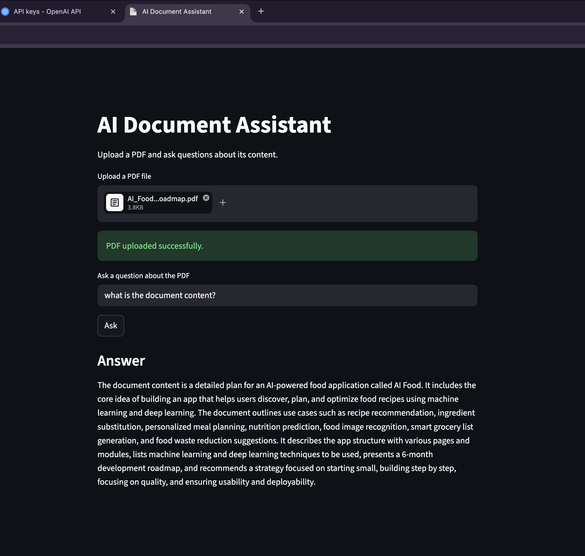

# AI Document Assistant

An AI-powered application that allows users to upload PDF documents and ask questions about their content using embeddings and semantic search.

# Live Demo
Frontend:
https://ai-document-assistant-1-lvec.onrender.com

Backend API: 
https://fastapi-backend-ekgg.onrender.com

## 📌 Overview

AI Document Assistant is a full-stack application that leverages modern AI techniques to understand and answer questions about uploaded documents.

It uses vector embeddings + FAISS similarity search to retrieve relevant information and generate accurate answers using an LLM.

## Features
-  Upload PDF documents
-  Intelligent semantic search
-  Context-aware question answering
-  Fast retrieval using FAISS
-  Deployed full-stack application (frontend + backend)

## Architecture
User 
 → Streamlit (Frontend) 
 → FastAPI (Backend)
 → Text Processing + Chunking 
 → OpenAI Embeddings 
 → FAISS Vector Search 
 → LLM Response

## Tech Stack
- Frontend: Streamlit
- Backend: FastAPI
- Embeddings: OpenAI API
- Vector DB: FAISS
- Deployment: Render
- Language : Python

## How It Works
1. User uploads a PDF document
2. Text is extracted and split into chunks
3. All chunks are converted into embeddings (batch processing)
4. Embeddings are stored in a FAISS index
5. User submits a question
6. Question is embedded
7. FAISS retrieves the most relevant chunks
8. LLM generates a final answer based on context


## API Endpoints

### Upload PDF
POST /upload

### Ask Question
POST /ask

## How to run

```bash
git clone <your-repo>
cd ai-document-assistant
python3 -m venv ai-venv
source ai-venv/bin/activate
pip install -r requirements.txt
```

## Environment Variables
Create a `.env` file:
```env
OPENAI_API_KEY=your_api_key_here
```

## Run backend server 
```bash
uvicorn main:app --reload
```
## Run frontend (Streamlit)
Open a new terminal and run:

```bash
streamlit run streamlit_app.py
```

## Notes
- Uses OpenAI API (requires API key)
- Optimized to reduce API calls using batch embeddings
- Designed to avoid rate limiting issues
- First request may be slow due to Render free tier (cold start)

## Future Improvements
- Support multiple PDF uploads
- Persistent FAISS storage
- Chat history and memory
- Authentication system
- Improved UI/UX

## Author
Nada Khalifa
Software Engineer | AI & Machine Learning Enthusiast

## If you like this project
Give it a star ⭐ on GitHub!